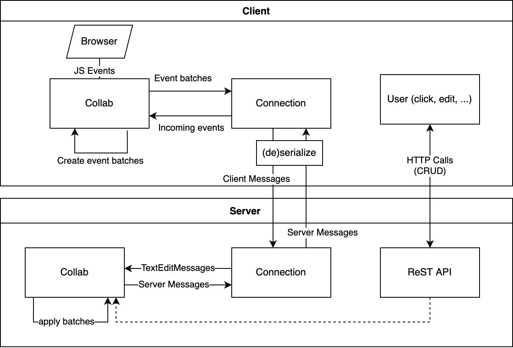

# Live Collab

## About

### Authors/Contributors

* [Filippo Orru](mailto:filippo.orru@edu.fh-joanneum.at)

### Description

This repository contains a live collaboration tool allowing multiple people to compose Markdown documents together, similar to Etherpad.

## Getting started

**Prerequisites**

- [IntelliJ Idea](https://www.jetbrains.com/idea/)
- [Kotlin](https://kotlinlang.org/) at least in version 1.4.10

**Steps**

1. Clone this repository:
    ```bash
    git clone https://git-iit.fh-joanneum.at/orrufili19/live-collab
    ```
1. Open with IntelliJ idea, trust the project and wait for initialization.

## Run

1. Open the project in IntelliJ
1. Start the server by running the "Server" configuration.
1. Done! The browser opens at http://localhost:7170/ You can access live collab from within your local network.

**Custom Configuration**

Modify the .env file to change the default host and port.

## Documentation

After taking a look at how other live collaboration tools, such as Google Docs or Etherpad work, I decided to make my own implementation.

The basic functionality is very easy to understand but there are some things to look out for, such as text merging and message batching.

I chose Kotlin and the KTOR server because I use it at work and like its ease of use and flexibility. Receiving JSON payloads is as simple
as including `ContentNegotiation { jackson() }` in the main function.

My initial idea of creating an online collaboration tool didn't change a lot during development. I had a reference in mind and knew what
functionality I wanted it to have.

For communication, it was clear from the start that I would be using websockets. For operations regarding creating, modifying and deleting
collabs, I chose to make a simple ReST API as it fit my needs perfectly.

**Criteria Catalog**

- Rest: Read single, Create, Update, Delete (16%)
- Websockets: Client send, client visualize, server handle, server query, server send (20%)
- Good practice (8%)
  - The client and server both have an architecture that separates (websocket)connection from the collab logic.
  - Server: the messages are easily extensible -- instead of being hard-coded, each one corresponds to a class with appropriate attributes
    that is serialized and deserialized for sending.
  - Server: the architecture is multithreaded and highly concurrent. There could potentially be thousands of people writing at the same time
    without problems because it uses non-blocking IO and concurrent heap datastructures.

**Graphical overview**


## Known Issues

- The text-merging functionality is good but not as highly-developed as it is in professional applications such as Google Docs. Thus, when
  writing on the same position at the same time, letters may be jumbled or mixed up. *But writing on separate positions works as intended.*
- The website is not optimized for mobile devices.
- Some advanced operations such as inserting non-text media don't work yet and undo and redo work but are not batched.

## Useful links

* A freely hosted version of Etherpad: [YoPad](https://yopad.eu/)